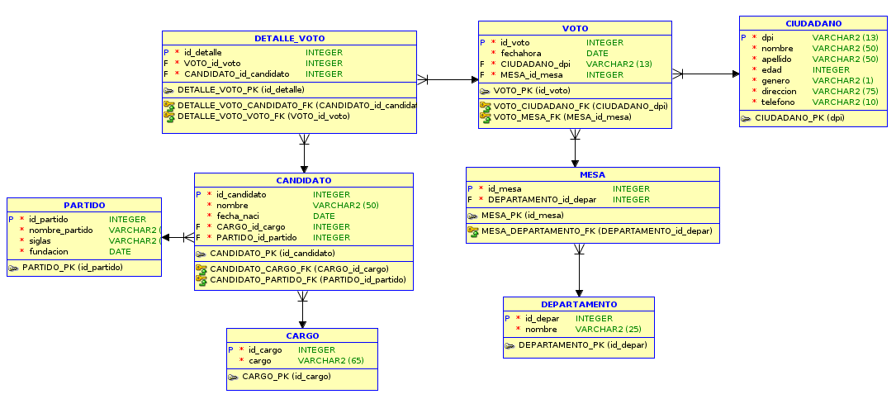

# DB_TSE

El programa DB_TSE es una implementación de una base de datos para el Tribunal Supremo Electoral (TSE), esta organización se sabe que debe de almacenar muchos datos en el dia de elecciones de Guatemala. Cuando carecemos de un sistema de información en nuestra organización, optamos por cambiar nuestra manera habitual de almacenar nuestros datos de forma física a una forma virtual. En estas situaciones, es necesario que diseñemos una estructura que nos permita guardar la información de manera persistente y de fácil acceso. 

Se utilizó modelado de bases de datos previo a la implementación del programa para tener un mejor orden y manejo de datos, la base de datos tiene los siguientes modelos:

### Modelo Conceputal

El objetivo principal de un modelo conceptual es proporcionar una vista clara y comprensible de la base de datos que sirvió como base para el diseño y desarrollo posterior del sistema de gestión de bases de datos (DBMS) y la base de datos en sí.

### Modelo Logico

El modelo lógico es una representación intermedia que se centra en cómo los datos se almacenaron y organizaron en el sistema de gestión de bases de datos.

### Modelo Relacional

Este modelo se centra en aspectos técnicos y de rendimiento, y su propósito principal es proporcionar una guía precisa para la creación y administración de la base de datos en el entorno de producción

Este modelo cuenta con las siguientes tablas:
- Ciudadano

    Esta tabla es la que contiene los datos de ciudadanos y tiene como llave primaria el atributo DPI. Esta relacionada de uno a muchos con la tabla voto.
- Voto

    Esta tabla es la que surgió de la normalización, contiene los datos de votos y tiene como llave primaria el atributo ID_VOTO. Esta relacionada de uno a muchos con la tabla detalle_voto y con mesa. Las llaves foraneas son DPI (tabla ciudadano) y ID_MESA (tabla mesa)
- Mesa

    Esta tabla es la que contiene los datos de mesas y tiene como llave primaria el atributo ID_MESA. Las llaves foraneas son ID_DEPAR (tabla departamento)
- Departamento

    Esta tabla es la que contiene los datos de departamento y tiene como llave primaria el atributo ID_DEPAR. 
- Detalle Voto

    Esta tabla es la que surgió de la normalización, contiene los datos de votos y tiene como llave primaria el atributo ID_DETALLE. Esta relacionada de uno a muchos con la tabla detalle_voto y con candidato. Las llaves foraneas son ID_VOTO (tabla voto) y ID_CANDIDATO (tabla candidato)
- Candidato

    Esta tabla es la que contiene los datos de candidatos y tiene como llave primaria el atributo ID_CANDIDATO. Las llaves foraneas son ID_CARGO (tabla cargo) y ID_PARTIDO (tabla partido)
- Partido

    Esta tabla es la que contiene los datos de partido y tiene como llave primaria el atributo ID_PARTIDO. 
- Cargo

    Esta tabla es la que contiene los datos de cargo y tiene como llave primaria el atributo ID_CARGO. 

**Normalización**

Las tablas anteriores muestran normalización, para ello al archivo CSV de votaciones se le aplicó la Primera Forma Normal (1NF) pero no era valida su implementación. La Segunda Forma Normal (2NF) si se podia aplicar al archivo por lo tanto se creo una nueva tabla con llave primaria id_detalle la cual es un atributo autoincremental.

### Implementación de API

Una API de Nodejs con MySQL es beneficioso debido a su rendimiento, escalabilidad, facilidad de uso y la amplia comunidad y recursos disponibles. Esto lo hace adecuado para una variedad de aplicaciones, desde pequeños proyectos hasta aplicaciones empresariales de alto tráfico.

El servidor de la aplicación inicia en el puerto **3000** y muestra un mensaje en la consola indicando que el servidor está corriendo en ese puerto. El puerto **3000** es comúnmente utilizado para aplicaciones web, pero puede ser cambiado a otro puerto si es necesario.

La aplicación se compone de 11 consultas las cuales cada una tiene un endpoint y pueden ser vistas en [script.sql](src/app/public/db.sql) ademas existen endpoint para la cración, carga y eliminación del modelo para la base de datos.

- _Universidad de San Carlos de Guatemala_
- _Facultad de Ingenieria_
- _Eddy Fernando Díaz Galindo_
- _201906558_